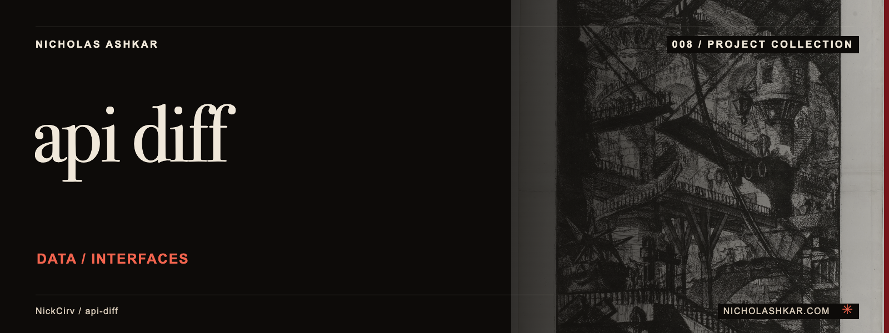

# api-diff

Compares two JSON files or HTTP responses to expose added, removed and changed values.


<a id="usage"></a>

<a id="compare-two-live-endpoints"></a>

<a id="compare-local-json-files-show-only-changes"></a>

## What it does

- Nested comparisons.
- Array matching by key.
- Depth and ignore controls.
- Table, minimal or JSON output.
- Optional JSON export.


<a id="install"></a>

## Quickstart

Prerequisites: Node.js `>=18` and npm. The checkout below pins the source used for this documentation.

```sh
git clone https://github.com/NickCirv/api-diff.git
cd api-diff
git checkout 0e87551bb94e9acb10f84c96ed36f2fe94730864
```

In the cloned directory:

Create `before.json` and `after.json` with these respective values:

```json
{"status":"queued","count":1}
```

Use `{"status":"done","count":2}` in `after.json`.

```sh
node index.js before.json after.json --format json --exit-code
```

**Expected behavior (illustrative, not captured):** Given two JSON files, prints structured differences and exits 1 when differences exist.

Examples are source-inspected, **not runtime-tested**. See the research record for verification gaps.

## Boundaries and data

Array matching and ignored paths affect what changes are visible. URL inputs make HTTP requests; request bodies and authorization headers must match the endpoint. A schema diff is not a compatibility proof.


<a id="ci-friendly-exit-1-if-diffs-found-ignore-timestamps"></a>

## Development

The manifest defines `npm test` as:

```sh
node --test
```

The captured suite is a smoke check, not end-to-end behavior coverage. Examples include “entry is valid JavaScript”, “--help exits 0”. Tests were not run for this documentation revision.

See [implementation and command reference](docs/REFERENCE.md) for the package scripts and inspected interfaces, and [research record](docs/RESEARCH.md) for the pinned source, document decisions and unresolved checks.

## License and contact

See [LICENSE](LICENSE) for the original terms and attribution. Legal text is unchanged.

[Nicholas Ashkar](https://nicholashkar.com/) · [Discuss a project](https://nicholashkar.com/#oxblood-contact)
